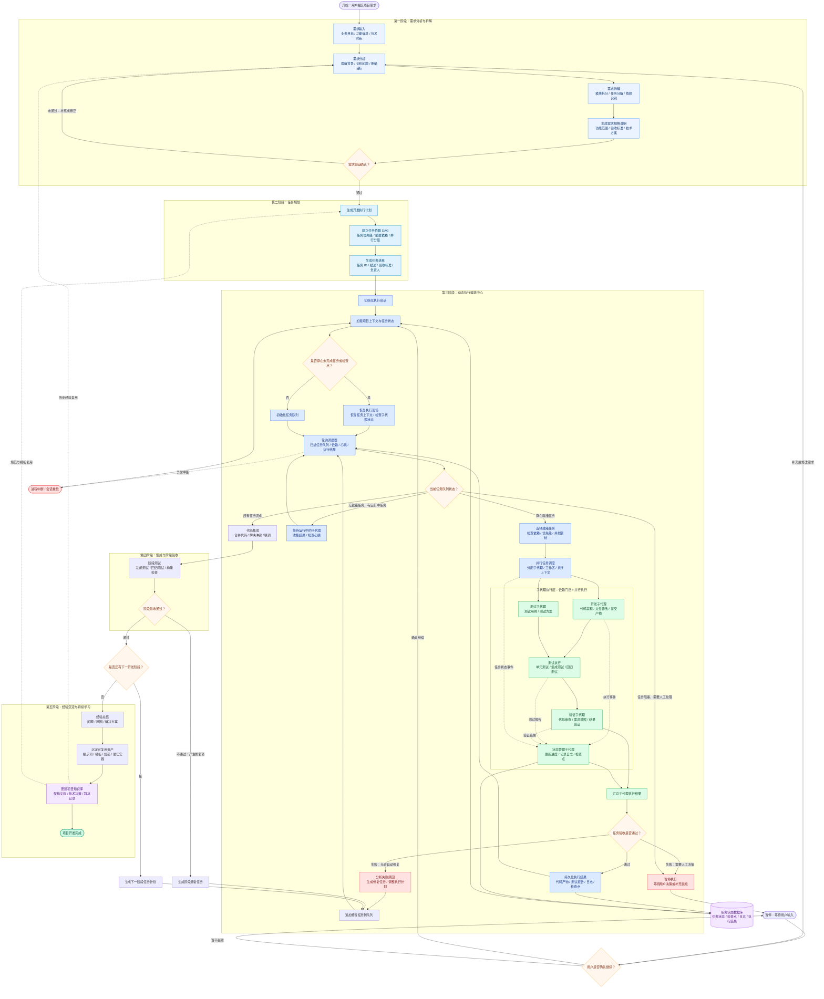

# 项目系统开发 AI 编程动态工作流

可执行步骤在 `.cursor/skills/ai-dev-workflow/SKILL.md`。任务状态库是 `.cursor/workflow/STATE.md`。知识库是 `.cursor/workflow/KNOWLEDGE.md`。

```mermaid
flowchart TD
    START(["开始：用户提交项目需求"])

    %% 第一阶段：需求分析
    subgraph REQUIREMENT["第一阶段：需求分析与拆解"]
        direction TB
        INPUT["需求输入<br/>业务目标 / 功能诉求 / 技术约束"]
        ANALYSIS["需求分析<br/>理解背景 / 识别问题 / 明确目标"]
        BREAKDOWN["需求拆解<br/>模块拆分 / 任务分解 / 依赖识别"]
        SPEC["生成需求规格说明<br/>功能范围 / 验收标准 / 技术方案"]
        CONFIRM{"需求验证确认？"}

        INPUT --> ANALYSIS
        ANALYSIS --> BREAKDOWN
        BREAKDOWN --> SPEC
        SPEC --> CONFIRM
        CONFIRM -- "未通过：补充或修正" --> ANALYSIS
    end

    START --> INPUT
    CONFIRM -- "通过" --> PLAN

    %% 第二阶段：执行计划
    subgraph PLANNING["第二阶段：任务规划"]
        direction TB
        PLAN["生成开发执行计划"]
        DAG["建立任务依赖 DAG<br/>任务优先级 / 前置依赖 / 并行分组"]
        TASKS["生成任务清单<br/>任务 ID / 描述 / 验收标准 / 负责人"]

        PLAN --> DAG --> TASKS
    end

    %% 第三阶段：动态执行编排
    subgraph ORCHESTRATOR["第三阶段：动态执行编排中心"]
        direction TB

        INIT["初始化执行会话"]
        LOAD["加载项目上下文与任务状态"]
        RESUME{"是否存在未完成任务或检查点？"}

        RESTORE["恢复执行现场<br/>恢复任务上下文 / 检查子代理状态"]
        CREATE["初始化任务队列"]

        POLL["轮询调度器<br/>扫描任务队列 / 依赖 / 心跳 / 执行结果"]
        QUEUE{"当前任务队列状态？"}

        SELECT["选择就绪任务<br/>检查依赖 / 优先级 / 并发限制"]
        DISPATCH["并行任务调度<br/>分配子代理 / 工作区 / 执行上下文"]

        INIT --> LOAD --> RESUME
        RESUME -- "是" --> RESTORE
        RESUME -- "否" --> CREATE

        RESTORE --> POLL
        CREATE --> POLL
        POLL --> QUEUE
        QUEUE -- "存在就绪任务" --> SELECT
        SELECT --> DISPATCH

        %% 子代理并行执行
        subgraph AGENTS["子代理执行层：依赖门控 + 并行执行"]
            direction LR

            DEV["开发子代理<br/>代码实现 / 文件修改 / 提交产物"]

            TEST_DESIGN["测试子代理<br/>测试用例 / 测试方案"]

            TEST_RUN["测试执行<br/>单元测试 / 集成测试 / 回归测试"]

            VERIFY["验证子代理<br/>代码审查 / 需求对照 / 结果验证"]

            STATUS["状态管理子代理<br/>更新进度 / 记录日志 / 检查点"]

            DEV --> TEST_RUN
            TEST_DESIGN --> TEST_RUN
            TEST_RUN --> VERIFY

            DEV -. "执行事件" .-> STATUS
            TEST_RUN -. "测试报告" .-> STATUS
            VERIFY -. "验证结果" .-> STATUS
        end

        DISPATCH --> DEV
        DISPATCH --> TEST_DESIGN
        DISPATCH -. "任务状态事件" .-> STATUS

        COLLECT["汇总子代理执行结果"]
        VERIFY --> COLLECT
        STATUS --> COLLECT

        PASS{"任务验收是否通过？"}

        COLLECT --> PASS

        CHECKPOINT["持久化执行结果<br/>代码产物 / 测试报告 / 日志 / 检查点"]
        REPAIR["分析失败原因<br/>生成修复任务 / 调整执行计划"]
        PAUSE["暂停执行<br/>等待用户决策或补充信息"]

        PASS -- "通过" --> CHECKPOINT
        PASS -- "失败：允许自动修复" --> REPAIR
        PASS -- "失败：需要人工决策" --> PAUSE

        REPAIR --> ADD_TASKS["追加修复任务到队列"]
        ADD_TASKS --> POLL

        CHECKPOINT --> POLL

        WAIT["等待运行中的子代理<br/>收集结果 / 检查心跳"]
        QUEUE -- "无就绪任务，有运行中任务" --> WAIT
        WAIT --> POLL

        QUEUE -- "所有任务完成" --> INTEGRATE
        QUEUE -- "任务阻塞，需要人工处理" --> PAUSE
    end

    TASKS --> INIT

    %% 第四阶段：集成与验收
    subgraph ACCEPTANCE["第四阶段：集成与阶段验收"]
        direction TB

        INTEGRATE["代码集成<br/>合并代码 / 解决冲突 / 联调"]
        TEST_ALL["阶段测试<br/>功能测试 / 回归测试 / 构建检查"]
        ACCEPT{"阶段验收通过？"}

        INTEGRATE --> TEST_ALL --> ACCEPT
    end

    %% 第五阶段：经验沉淀
    subgraph KNOWLEDGE["第五阶段：经验沉淀与持续学习"]
        direction TB

        EXPERIENCE["经验总结<br/>问题 / 原因 / 解决方案"]
        TEMPLATE["沉淀可复用资产<br/>提示词 / 模板 / 规范 / 最佳实践"]
        KB["更新项目知识库<br/>架构文档 / 技术决策 / 踩坑记录"]
        FINAL(["项目开发完成"])

        EXPERIENCE --> TEMPLATE --> KB --> FINAL
    end

    %% 阶段验收分支
    ACCEPT -- "不通过：产生修复项" --> STAGE_FIX["生成阶段修复任务"]
    STAGE_FIX --> ADD_TASKS

    ACCEPT -- "通过" --> NEXT{"是否还有下一开发阶段？"}
    NEXT -- "是" --> NEXT_PLAN["生成下一阶段任务计划"]
    NEXT_PLAN --> ADD_TASKS
    NEXT -- "否" --> EXPERIENCE

    %% 断点续跑与状态存储
    STATE_DB[("任务状态数据库<br/>任务状态 / 检查点 / 日志 / 执行结果")]

    CHECKPOINT --> STATE_DB
    STATUS --> STATE_DB
    STATE_DB --> LOAD

    INTERRUPT(["进程中断 / 会话重启"])
    POLL -. "异常中断" .-> INTERRUPT
    INTERRUPT --> LOAD

    PAUSE --> PAUSED(["暂停：等待用户输入"])
    PAUSED --> USER_REPLY{"用户是否确认继续？"}
    USER_REPLY -- "补充或修改需求" --> ANALYSIS
    USER_REPLY -- "确认继续" --> LOAD
    USER_REPLY -- "暂不继续" --> PAUSED

    %% 经验反馈
    KB -. "历史经验复用" .-> ANALYSIS
    KB -. "规范与模板复用" .-> PLAN

    %% 样式
    classDef requirement fill:#eaf3ff,stroke:#3b82f6,color:#173b70
    classDef planning fill:#e0f2fe,stroke:#0284c7,color:#0c4a6e
    classDef orchestrator fill:#dbeafe,stroke:#2563eb,color:#1e3a8a
    classDef agent fill:#dcfce7,stroke:#16a34a,color:#14532d
    classDef decision fill:#fff7ed,stroke:#f59e0b,color:#7c2d12
    classDef storage fill:#f3e8ff,stroke:#9333ea,color:#581c87
    classDef warning fill:#fee2e2,stroke:#ef4444,color:#7f1d1d
    classDef success fill:#d1fae5,stroke:#059669,color:#064e3b

    class INPUT,ANALYSIS,BREAKDOWN,SPEC requirement
    class PLAN,DAG,TASKS planning
    class INIT,LOAD,RESTORE,CREATE,POLL,SELECT,DISPATCH,CHECKPOINT,WAIT orchestrator
    class DEV,TEST_DESIGN,TEST_RUN,VERIFY,STATUS,COLLECT agent
    class CONFIRM,RESUME,QUEUE,PASS,ACCEPT,NEXT,USER_REPLY decision
    class STATE_DB,KB storage
    class PAUSE,INTERRUPT,REPAIR warning
    class FINAL success
```
